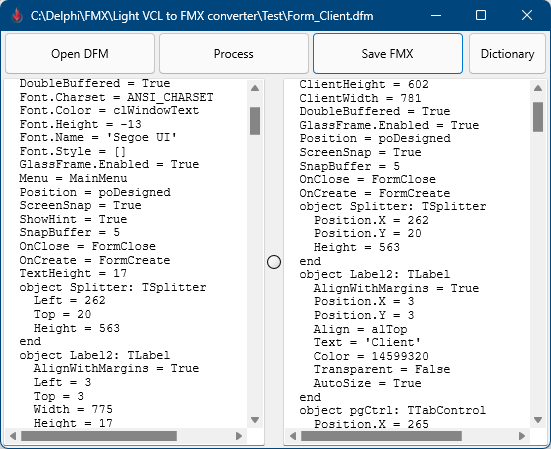
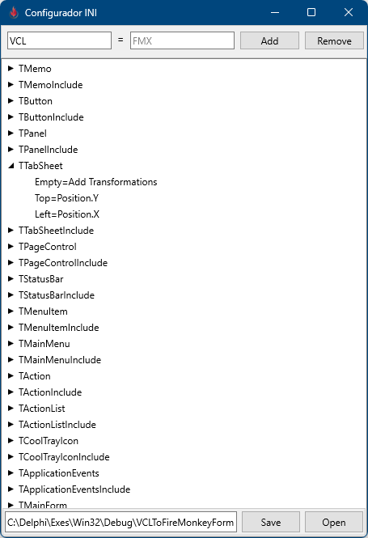

# Light VCL2FMX

VCL to FMX converter
Converts Delphi DFM files to FMX.

This is a major update!

Improvements:
 - True unicode support!
 - Fixed bugs
 - Smaller code
 - Removed all Hints and Warnigs 
 - Better settings editor
 - TImage conversion
 - TImageList conversion
 - Added TAlign replace
 